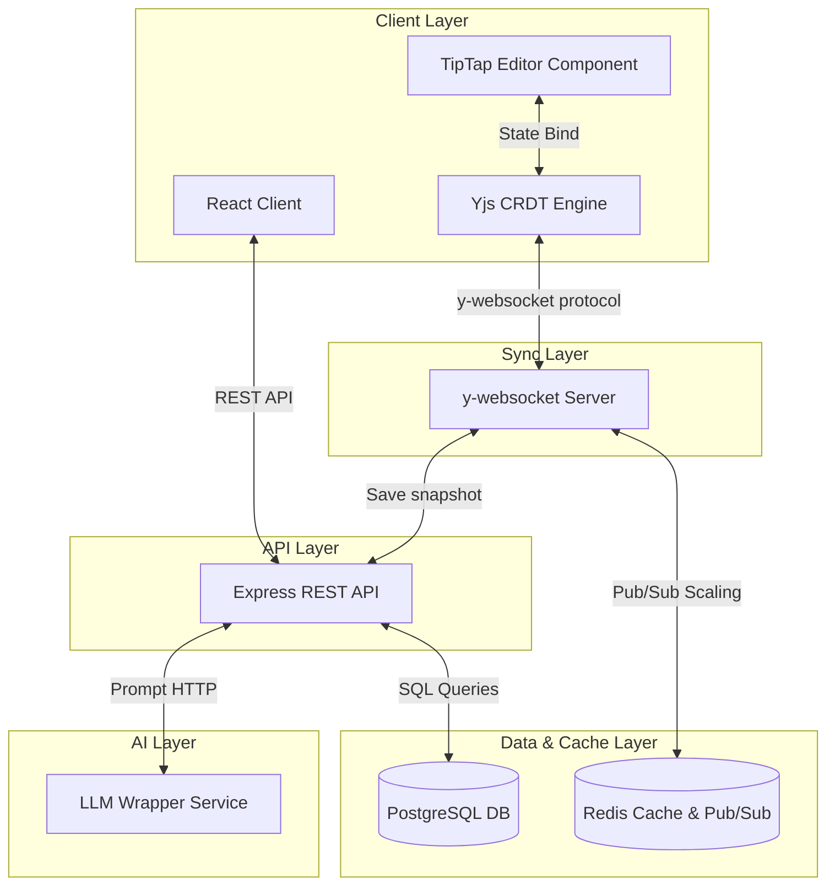

# InkScribe System Architecture

InkScribe is a scalable, real-time collaborative editor platform. This document outlines the design architecture of the various layers, the request flows, and security boundaries.

## Architecture Layers

InkScribe is structured as a five-layer system:

### 1. Client Layer (React)
- **Framework**: Vite + React.
- **Editor**: TipTap (wrapper around ProseMirror), which provides rich-text capabilities.
- **CRDT Synchronization**: Yjs is used to represent the document contents as a Conflict-Free Replicated Data Type. Changes are calculated locally, enabling offline editing and conflict resolution.
- **Auth state**: Handled locally via JWT token storage in `localStorage`.

### 2. Sync Layer (Node.js WebSocket Server)
- **Role**: Synchronizes operations between multiple clients editing the same document.
- **Technology**: Built using `y-websocket` library on top of `ws`.
- **Presence**: Tracks active client cursors and presence indicators, broadcasting them to peers.
- **Persistence**: Emits doc updates and periodically saves document state back to the PostgreSQL database via the API server.

### 3. API Layer (Express REST API)
- **Role**: Handles stateless operations (authentication, document metadata CRUD, permissions).
- **Security**: Protects routes using `authMiddleware` verifying JWT signatures.
- **Access Control**: Validates collaborator permissions before allowing read/write operations to the database.

### 4. Data Layer (PostgreSQL + Redis)
- **PostgreSQL**: Stores persistent relational tables (`users`, `documents`, `document_permissions`).
- **Redis**: Stores user presence lists, and handles Pub/Sub message broker operations to scale WebSocket servers horizontally.

---

## Key Flows

### 1. Authentication & JWT Issuance
1. Client submits email/password to `/api/auth/login`.
2. API verifies credentials, generates JWT containing user ID/email signed with a server secret.
3. Client saves token in `localStorage` and includes it in the `Authorization: Bearer <token>` header for subsequent requests.

### 2. Access Control Enforcements
Whenever a document operation is requested:
- For **Read/View**: API checks if the user is the owner, or if there is a record in `document_permissions` matching `(document_id, user_id)`.
- For **Write/Update**: API verifies that the user is the owner, or that their permission record contains `role = 'editor'`.

### 3. Document Collaboration (Sprint 2 Preview)
- When a document is opened, the client connects to `ws://localhost:6000/doc/<doc_id>`.
- Client and server synchronize their Yjs states using the sync protocol.
- Client cursor coordinates are tracked and broadcasted via websocket to update peer cursors.
