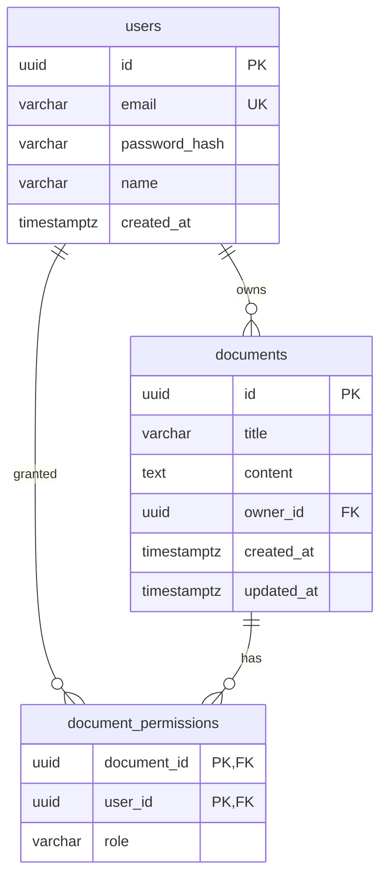

# Database Schema Documentation

InkScribe utilizes PostgreSQL as its persistent relational database. Below is the detailed layout of the tables, relationships, and constraint definitions.

## Entity Relationship Diagram



---

## Tables Definition

### 1. `users`
Stores user authentication details and profiles.

| Column | Type | Constraints | Description |
| :--- | :--- | :--- | :--- |
| `id` | `UUID` | `PRIMARY KEY`, default `uuid_generate_v4()` | Unique user identifier |
| `email` | `VARCHAR(255)` | `UNIQUE`, `NOT NULL` | User email address (lowercase) |
| `password_hash` | `VARCHAR(255)` | `NOT NULL` | Hashed password using bcrypt |
| `name` | `VARCHAR(255)` | `NULL` | Full name of the user |
| `created_at` | `TIMESTAMPTZ` | `DEFAULT CURRENT_TIMESTAMP` | Signup timestamp |

### 2. `documents`
Stores document metadata and body contents.

| Column | Type | Constraints | Description |
| :--- | :--- | :--- | :--- |
| `id` | `UUID` | `PRIMARY KEY`, default `uuid_generate_v4()` | Unique document identifier |
| `title` | `VARCHAR(255)` | `NOT NULL` | Document title |
| `content` | `TEXT` | `NULL` | Document HTML/text body contents |
| `owner_id` | `UUID` | `FOREIGN KEY` references `users(id)` `ON DELETE CASCADE` | Creator/Owner of the document |
| `created_at` | `TIMESTAMPTZ` | `DEFAULT CURRENT_TIMESTAMP` | Creation timestamp |
| `updated_at` | `TIMESTAMPTZ` | `DEFAULT CURRENT_TIMESTAMP` | Last updated timestamp |

### 3. `document_permissions`
Handles sharing configurations and user roles on documents.

| Column | Type | Constraints | Description |
| :--- | :--- | :--- | :--- |
| `document_id` | `UUID` | `PRIMARY KEY`, `FOREIGN KEY` references `documents(id)` `ON DELETE CASCADE` | Shared document identifier |
| `user_id` | `UUID` | `PRIMARY KEY`, `FOREIGN KEY` references `users(id)` `ON DELETE CASCADE` | Collaborator user identifier |
| `role` | `VARCHAR(50)` | `NOT NULL`, check role in `('editor', 'viewer')` | Permission role allowed for collaborator |

---

## SQL Initialization Script (DDL)

```sql
CREATE EXTENSION IF NOT EXISTS "uuid-ossp";

-- Create users table
CREATE TABLE users (
    id UUID PRIMARY KEY DEFAULT uuid_generate_v4(),
    email VARCHAR(255) UNIQUE NOT NULL,
    password_hash VARCHAR(255) NOT NULL,
    name VARCHAR(255),
    created_at TIMESTAMP WITH TIME ZONE DEFAULT CURRENT_TIMESTAMP
);

-- Create documents table
CREATE TABLE documents (
    id UUID PRIMARY KEY DEFAULT uuid_generate_v4(),
    title VARCHAR(255) NOT NULL,
    content TEXT,
    owner_id UUID REFERENCES users(id) ON DELETE CASCADE,
    created_at TIMESTAMP WITH TIME ZONE DEFAULT CURRENT_TIMESTAMP,
    updated_at TIMESTAMP WITH TIME ZONE DEFAULT CURRENT_TIMESTAMP
);

-- Create document_permissions table
CREATE TABLE document_permissions (
    document_id UUID REFERENCES documents(id) ON DELETE CASCADE,
    user_id UUID REFERENCES users(id) ON DELETE CASCADE,
    role VARCHAR(50) NOT NULL CHECK (role IN ('editor', 'viewer')),
    PRIMARY KEY (document_id, user_id)
);

-- Indexes for performance optimizations
CREATE INDEX idx_users_email ON users(email);
CREATE INDEX idx_documents_owner ON documents(owner_id);
CREATE INDEX idx_permissions_user ON document_permissions(user_id);
```
