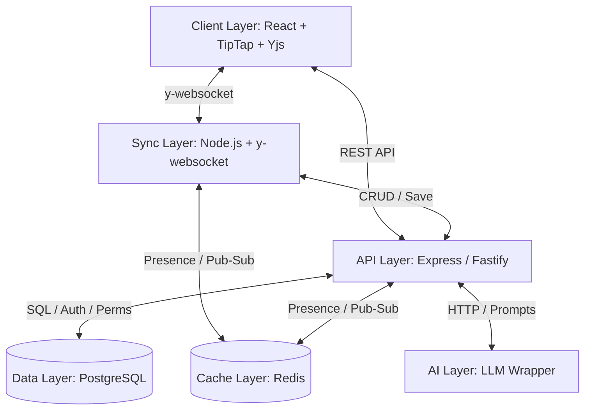

# Project Proposal: InkScribe – Real-Time Collaborative Writing Engine

## 1. Project Abstract
InkScribe is an advanced real-time collaborative writing engine designed for internet-scale operations. The goal of InkScribe is to support millions of concurrent users writing, editing, and interacting on shared documents in real time. It serves as a modern, extensible publishing and knowledge infrastructure, providing instant sync, presence tracking, role-based authorization, and AI-assisted tools.

## 2. Problem Statement
Writing and collaborating online today requires high-performance, real-time synchronization, offline support, and low latency. Traditional document stores are not designed for concurrent modifications, leading to merge conflicts and lost updates. 
InnovateInk needs a scalable, secure, and resilient collaborative engine that:
1. Performs real-time document synchronization with conflict-free replicated data types (CRDTs).
2. Manages presence (e.g. active users, colored cursor tracking).
3. Secures user data through robust JWT authentication and fine-grained authorization (Owner, Editor, Viewer roles).
4. Automates formatting, summaries, and suggestions via AI-assisted services.

## 3. Proposed Solution & Architecture
InkScribe is split into a five-tier architecture:

- **Client Layer**: A React SPA utilizing TipTap as the rich-text editor and Yjs for client-side CRDT state, enabling local offline edits and real-time syncing.
- **Sync Layer**: A Node.js server powered by `y-websocket` that synchronizes changes using Yjs document updates and communicates presence states.
- **API Layer**: An Express REST API for handling user authorization, signup/login, document CRUD operations, and document sharing configurations.
- **Data Layer**: PostgreSQL for structured storage of users, documents, permissions, and metadata. Redis for cache storage, active session presence tracking, and scaling WebSocket messaging (Pub/Sub).
- **AI Layer**: An optional service wrapper to generate summaries or text completion based on document context.

## 4. Tech Stack
- **Frontend**: React, Vite, TipTap (rich-text framework), Yjs (CRDT engine), CSS (Vanilla CSS).
- **Backend / Sync**: Node.js, Express, `y-websocket`, JWT (`jsonwebtoken`), `bcryptjs`.
- **Database**: PostgreSQL (relational storage), Redis (pub/sub & session cache).
- **DevOps / Infra**: Docker Compose, GitHub Actions (CI/CD).

## 5. Development Roadmap (8-Week Plan)
- **Sprint 1 (Weeks 1-2): Foundation + Single-user Editor**
  Scaffold React app & Express API, configure PostgreSQL DB via Docker, set up JWT Authentication/Authorization, and build basic single-user styled TipTap editor.
- **Sprint 2 (Weeks 3-4): Real-Time Sync**
  Establish Node.js Sync Server, connect Yjs to TipTap (y-prosemirror), implement WebSocket document sync, add user cursor presence, and persist document states.
- **Sprint 3 (Weeks 5-6): Access Control & Auth Polish**
  Protect routes with role middleware, build Client Signup/Login UI, implement document sharing interfaces, and increase unit test coverage to 60%+.
- **Sprint 4 (Weeks 7-8): Polish, AI & Deliverables**
  Integrate AI summaries, perform complete E-End testing, record demo video, write final report, and submit.

## 6. Success Evaluation Metrics
- **Real-Time Latency**: <100ms document synchronization latency between concurrent clients.
- **Access Control Enforcements**: Viewing roles cannot edit or modify document states.
- **System Stability**: 100% database persistence on document save operations.
- **Code Quality**: Enforced linting and unit test coverage >= 60%.
